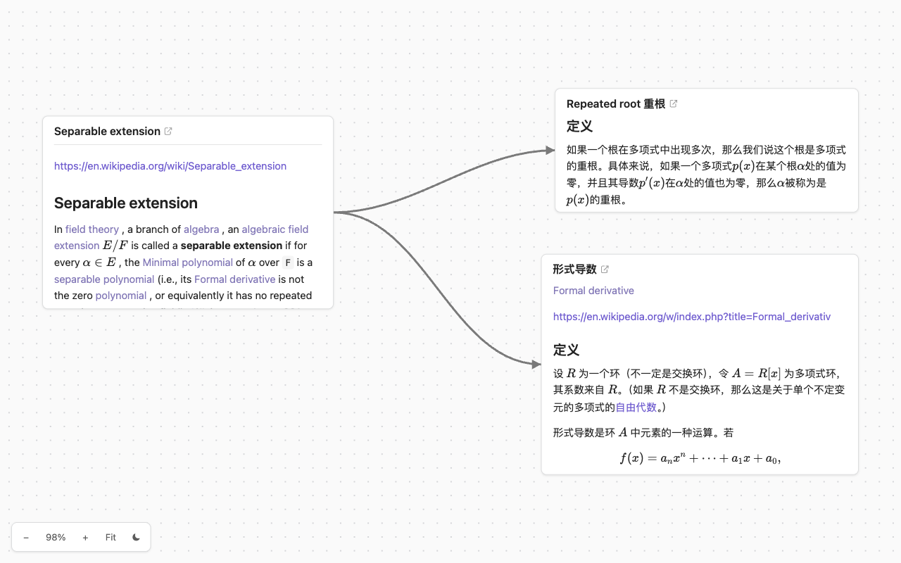

# obsidian-canvas-render

Render Obsidian `.canvas` files on the web, close to how Obsidian draws them — embedded notes, LaTeX, edges and all.



**[Live demo](https://drmingdrmer.github.io/obsidian-canvas-render/)**

The file format is [JSON Canvas](https://jsoncanvas.org), the open spec Obsidian publishes under the MIT license. Obsidian's own renderer cannot be reused — it is minified into `app.js` inside `obsidian.asar` and wired to Obsidian's internal Vault, Workspace and MarkdownRenderer objects — so this is a fresh implementation against the spec: no build step, nothing to install, three files a browser loads directly.

## Quick start

The page fetches its content at runtime, so it has to be served over HTTP:

```bash
./serve.sh          # port 8000 by default; pass another as the first argument
```

Point it at a canvas with `?canvas=my-board/index.canvas`. That canvas file and the notes it references must sit under the served directory, keeping the paths the canvas stores. `sync-vault.sh` copies them out of an Obsidian vault for you, and fails if one of them is missing there:

```bash
./sync-vault.sh ~/Documents/my-vault my-board/index.canvas
```

## Deploying

Any static host serves the repository as-is. On GitHub Pages, **keep the `.nojekyll` file in the repository root**: Jekyll compiles `.md` files into `.html` instead of copying them through, so without it every note 404s and every file node on the canvas fails to load.

## URL parameters

| Parameter | Meaning |
|---|---|
| `canvas` | The `.canvas` file to render, relative to the page. Defaults to `vault/demo.canvas` |
| `vault` | The vault root that file nodes resolve against. Defaults to the directory holding the canvas file |
| `note` | Render a single markdown file on its own, for reading, instead of a canvas |
| `raw` | Show a single markdown file as plain source |

All four take a path relative to the page, or an `https://` URL on one of the hosts in `REMOTE_HOSTS` at the top of `canvas-render.js` — `raw.githubusercontent.com` by default. Every other host is refused: a note is rendered with `innerHTML`, so whichever host serves one can run script in this page's origin.

File nodes store paths relative to the vault root, so a canvas sitting at the root of its own directory needs no `vault` — that is how `?canvas=vault/demo.canvas` works here. Name the root explicitly when the canvas sits deeper in the vault, as it does in Obsidian when boards go in `boards/` and notes in `pages/`:

```
?canvas=notes/boards/plan.canvas&vault=notes/
```

Omitting it then renders the canvas with every file card reading `Cannot load … (HTTP 404)`.

### A canvas on another host

A canvas and the notes it embeds can stay in a GitHub repository, with nothing copied under the served directory:

```
?canvas=https://raw.githubusercontent.com/user/repo/refs/heads/main/boards/plan.canvas
```

The vault root still defaults to the directory holding the canvas, so notes stored beside it need no `vault`; notes elsewhere in the repository need the root named, `vault=https://raw.githubusercontent.com/user/repo/refs/heads/main/`.

The host has to send `Access-Control-Allow-Origin`, which `raw.githubusercontent.com` does. Without that header the browser blocks the fetch before any status code exists, and the page reports the block instead of an HTTP error.

## Supported

Nodes: `text`, `file`, `link`, `group`.
Edges: `fromSide` / `toSide` (both optional), the `fromEnd` / `toEnd` arrow switches, `label`, `color`.
Colors: Obsidian's six presets (`"1"`–`"6"`) and custom hex values.

Block-reference subpaths `#^blockid` render the whole document, and `[[wikilinks]]` are styled but not navigable.

## Interaction

Dragging a card's body selects text rather than panning, and a card whose content overflows scrolls on its own. A plain wheel pans; ⌘/Ctrl + wheel or a trackpad pinch zooms.

A file card's title row carries two links: the title text opens the note rendered for reading (`?note=`), and the `</>` icon beside it opens the same file's markdown source (`?raw=`). A link card's title points at its URL.

## Files

`canvas-render.js` holds the renderer, with the constants worth tuning — zoom range, edge curvature, wheel sensitivity, default canvas — at the top. Everything outside `vault/` is the application; `vault/` is one content bundle, and serving a second canvas means adding a second directory of the same shape.

The application code is licensed under [Apache-2.0](LICENSE). [marked](https://github.com/markedjs/marked) 12.0.2 ([MIT](lib/LICENSE-marked)) and [KaTeX](https://katex.org) 0.16.11 ([MIT](lib/LICENSE-katex)) are vendored under `lib/` rather than loaded from a CDN, so the page works offline. The sample notes under `vault/pages/` are adapted from Wikipedia and stay under [CC BY-SA 4.0](https://creativecommons.org/licenses/by-sa/4.0/), each naming its source article at the bottom.
